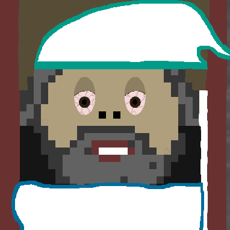

<!-- PROJECT LOGO -->
 

  

<h3 align="center">
Teachable Machines
 
Am Beispiel von Bildklassifizierungsverfahren

  

     
    <a href="https://lakusan.github.io/KI-Projekt/"><strong>Live Version »</strong></a>
     
     
    <a href="https://github.com/Lakusan/KI-Projekt/blob/main/11012049_KI_Pr%C3%A4sentation.pdf"><strong>Präsentation »</strong></a>

<!-- ABOUT THE PROJECT -->
## About The Project

     
    

    Dieses KI-Projekt wurde im Zuge des Moduls KI für Game Developer an der SRH Hochschule Heidelberg im Studiengang B.Sc. Virtuelle Realitäten - Game Development als Prüfungsleistung entwickelt.
    

    

<!-- Dependencies -->
## Dependencies

* Technical
  * ml.js (v. 0.12.2)
  * JQuery (v. 3.1.0)
  * p5.js (v. 0.9.0)
  * Tensorflow.js
* Models
  * Tensorflow Handpose
  * [Google's Teachable Machine by Google Creative Lab](https://teachablemachine.withgoogle.com/)
  * [MobileNet](https://arxiv.org/abs/1801.04381)

<!-- Feature Set -->
## Features

- [X] KNN
  - [X] Anschauliche Darstellung des Trainings- und Klassifizierungsprozesses eines KNN
    - [README](https://github.com/Lakusan/KI-Projekt/blob/main/public/KNN/README.md) 

- [X] Transferlearning
  - [X] Hands on teachable machines. Erstellung eingener Datasets inkl. Training zur Bildklassifizierung.
    - [README](https://github.com/Lakusan/KI-Projekt/blob/main/public/Transferlearning/README.md) 

- [X] Memetings
  - [X] Trainiertes Modell zur Handgestenerkennung zur Einblendung von Bildern während virtueller rMeetings in virtueller Kamera.
    - [README](https://github.com/Lakusan/KI-Projekt/blob/main/public/Memetings/README.md) 

- [X] Handtracking
  - [X] Universelle Handgestenerkennung zur Einblendung von Bildern.
    - [README](https://github.com/Lakusan/KI-Projekt/blob/main/public/Handtrack/README.md) 

<!-- LICENSE --> 
## License

Distributed under the MIT License. See `LICENSE` for more information.
 

<!-- CONTACT -->
## Contact

* Project Link: [https://github.com/Lakusan/KI-Projekt](https://github.com/Lakusan/KI-Projekt)
* [![LinkedIn][linkedin-shield]][linkedin-url]

[linkedin-shield]: https://img.shields.io/badge/-LinkedIn-black.svg?style=for-the-badge&logo=linkedin&colorB=555
[linkedin-url]: https://www.linkedin.com/in/lakusan
